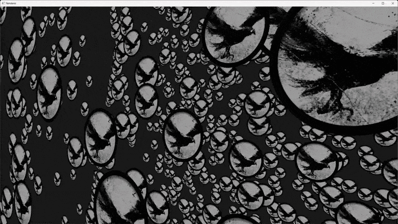

# Renderer

Native Windows OpenGL renderer prototype written in C with the goal of expanding on my [previous OpenGL experiment](https://github.com/holychowders/opengl-test-3d) to build a cleaner, more handmade rendering foundation for lighting, camera movement, asset loading, and standalone demos.

## Current Features

- Pure C
- Native Win32 window creation and message loop
- WGL for Windows OpenGL context setup
- GLEW for loading modern OpenGL function pointers
- Runtime shader loading from `assets/shaders`
- PNG texture loading with `stb_image`
- Custom math for vectors, matrices, transforms, perspective projection, and look-at camera transforms
- Basic animated demo scene using MVP transforms

## Roadmap

### Near-Term Goals

- Basic lighting: diffuse and specular shading
- Easy keyboard/mouse controls for standalone demos
- Shader hotloading
- Build as library to enable standalone demo programs
- Renderer hotloading
- glTF loading
- Live shader/material editor

### Medium-Term Goals

- Software rendering path
- Direct3D 12 backend
- Runtime asset browser/loader
- Optimization experiments: profiling, culling, SIMD, multithreading, etc
- Multiple lighting and materials pipelines

### Long-Term Goals

- Linux platform layer
- Procedural geometry
- Level editor
- Replace GLEW with custom OpenGL function loader

## Build

Requirements: Windows, Clang, CMake, Ninja

- Build: `tools\build.bat`
- Run: `tools\run.bat`
- Lint: `tools\check.bat`

## Previous Renderers

[OpenGL Test 3D](https://github.com/holychowders/opengl-test-3d)

[OpenGL Test 2D](https://github.com/holychowders/opengl-test)

